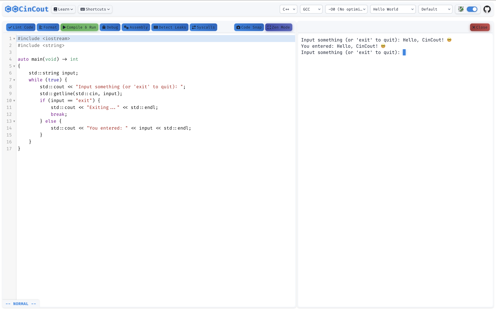

# CinCout

This project is a web IDE (integrated development environment) for _C/C++_ language. It allows users to write code, compile, analyze, and run C/C++ programs directly in their web browser. The application is built using TypeScript/Node.js for the backend and HTML/CSS/TypeScript for the frontend. It provides a user-friendly interface with rich features.

<div align="center">


[](https://wakatime.com/badge/github/Pp3ng/CinCout)

</div>

# Screenshots 📷



# embark it live at [CinCout](https://cincout.fly.dev/)

---

# Architecture

This is the architecture diagram of the project.Following frontend and backend isolated architecture.


---

# Features ✨

| Category          | Feature                 | Description                                  |
| ----------------- | ----------------------- | -------------------------------------------- |
| **Code Editor**   | Syntax Highlighting     | Language-specific highlighting for C/C++     |
|                   | Code Folding            | Collapsible code blocks and sections         |
|                   | Vim Mode                | Optional Vim keybindings for editor          |
|                   | Code Snapshot           | Save code as image with syntax highlighting  |
| **Compilation**   | Multiple Compilers      | Support for GCC and Clang                    |
|                   | Optimization Levels     | Various optimization flags (-O0 to -O3, -Os) |
|                   | Assembly Generation     | View generated assembly code                 |
| **Execution**     | Real-time program       | PTY-based terminal for interactive programs  |
|                   | WebSocket Communication | Bidirectional real-time communication        |
| **Code Analysis** | Style Checking          | Static code analysis with cppcheck           |
|                   | Memory Analysis         | Memory leak detection with Valgrind          |
|                   | Code Formatting         | Automatic code formatting with clang-format  |
| **UI/UX**         | Multiple Themes         | Various editor and terminal color schemes    |
|                   | Responsive Design       | Mobile-friendly interface and layout         |
|                   | Keyboard Shortcuts      | Customized shortcuts for common actions      |

---

# Shortcut Keys 🔑

| Action           | Windows/Linux | macOS      |
| ---------------- | ------------- | ---------- |
| Compile and Run  | Ctrl + Enter  | ⌘ + Return |
| Save Code        | Ctrl + S      | ⌘ + S      |
| Code Snapshot    | Ctrl + P      | ⌘ + P      |
| Open Code File   | Ctrl + O      | ⌘ + O      |
| Toggle Code Fold | Ctrl + K      | ⌘ + K      |
| View Assembly    | Alt + 1       | ^ + 1      |
| Format Code      | Alt + 2       | ^ + 2      |
| Style Check      | Alt + 3       | ^ + 3      |
| Memory Check     | Alt + 4       | ^ + 4      |
| Close Output     | ESC           | ESC        |

---

# Future improvements 🚀

- [x] Lerverage `node-pty` and `xterm.js` for terminal emulation
- [ ] Use `React` for the frontend instead of `Vanilla TypeScript`
- [ ] Implement `clang-tidy` for code analysis
- [ ] Add more themes and customization options
- [ ] Integrate `gdb` `lldb` for debugging
- [ ] More modern `UI/UX` design

# Setup Guide

## Prerequisites

First, install the required packages:

```bash
# For Debian/Ubuntu
sudo apt update
sudo apt install nodejs npm gcc g++ clang clang-format valgrind cppcheck
```

## Project Setup

1. Clone the repository and install dependencies:

````bash
# Clone the repository
git clone https://github.com/Pp3ng/CinCout.git
``` 2. Build and start the application:

```bash
# Install dependencies and build both frontend and backend
npm install
npm run build

# Start the server
npm start
````

3. Access the application at http://localhost:9527

---

## Run with Docker (Recommended)

Docker provides an isolated environment with all dependencies pre-installed, making deployment simple and ensures safety and security.

please make sure you have Docker installed on your system. You can follow the official [Docker installation guide](https://docs.docker.com/get-docker/) for your operating system.

This project provides a Dockerfile that allows you to run the application in a Docker container.

### Build and Run the Docker Image

```bash
# Navigate to project directory
cd CinCout
# Build and run
docker-compose up --build -d

```

#### or

pull the pre-built image from Docker Hub:

```bash
docker pull pp3ng/cincout:latest
docker run -d -p 9527:9527 pp3ng/cincout:latest
```

Then you can access the application at http://localhost:9527

---

# Contributing 🤝

Welcome contributions! Please feel free to fork to make any creative changes you want and make a pull request.
